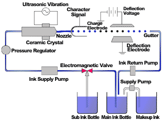

# Continuous Inkjet Printing Simulation (MATLAB)

This project simulates how **continuous inkjet printers (CIJPs)** deflect and place ink droplets onto a substrate using electric fields.  
It converts an input image into a sequence of voltage waveforms that would be applied to deflection plates, showing how characters or shapes could be printed.

---

## 🖨️ Background

Continuous inkjet printers operate by:
1. Breaking up an ink stream into droplets using piezoelectric oscillation.
2. Charging selected droplets with a charging electrode.
3. Deflecting charged droplets using electric fields between deflection plates so they land in the correct positions on the substrate:contentReference[oaicite:2]{index=2}.

This project demonstrates that process in simulation:
- An input image (black/white) is translated into a **voltage waveform vector**.
- Each voltage corresponds to a deflection needed to place an ink droplet at the right location.
- A `0 V` entry indicates a line change (printer carriage moves to next row).
- Droplet placement is visualized as scatter plots and animated GIFs.

Compared to **drop-on-demand (DOD) printers**, CIJPs are faster and more common in industrial packaging, though less precise.

---

## ✨ Features

- MATLAB implementation (`.mlx` live script) with full comments.
- Converts any image into an **electric field matrix** and then a **voltage waveform vector**.
- Generates:
  - **Voltage vs. Time waveform plot**
  - **Reconstructed substrate output (scatter plot)**
  - **Animated GIFs** showing the printing process line by line.

---

## 📂 Repository Structure

| File | Description |
|------|-------------|
| `letter_gifs` | Example gifs produced by the MATLAB live script |
| `Inkjet Printing Paper.pdf` | Detailed write-up of math/physics behind the code |
| `Inkjet_Printing.mlx` | MATLAB live script implementing the simulation. |
| `Inkjet_Printing.txt` | Text file of MATLAB simulation code for online viewing. |

---

## 🚀 Usage

1. Open the `.mlx` file in **MATLAB** (R2022a or later recommended).
2. Run the script — it will:
   - Read in an input image (matrix format).
   - Compute the required electric field at each pixel.
   - Convert that field into a **voltage waveform vector**.
   - Generate output plots and save animations.
3. Replace the input image with your own (black/white works best).

---

## 📊 Example Outputs

### Voltage Waveform
Shows discrete steps of voltage over time, with `0 V` marking line changes.

.gif)

### Animated Ink Droplet Printing
Ink droplets deflected line by line to reconstruct the input image.

---

## 🔬 References

- [1] D. K. Cheng, Field and Wave Electromagnetics, Second Edition. Reading, MA: Addison-
Wesley Pub. Co., 1989.
- [2] M. Ikegawa, M. Ishikawa, E. Ishii, N. Harada, and T. Takagishi, “Ink-particle simulation
for continuous inkjet type printer,” NIP &amp; Digital Fabrication Conference, vol. 31, no.
1, pp. 13–18, 2015. doi:10.2352/issn.2169-4451.2015.31.1.art00006_1
- [3] T. Otowa, S. Tsubouchi, and Y. Suwa, “Analysis of the ink-stream break-up phenomenon
in continuous inkjet printing,” ACS Omega, vol. 8, no. 38, pp. 34442–34447, 2023.
doi:10.1021/acsomega.3c02790

---

## 👤 Authors

Project by **Benjamin Tung** and **Hanson Nguyen**
